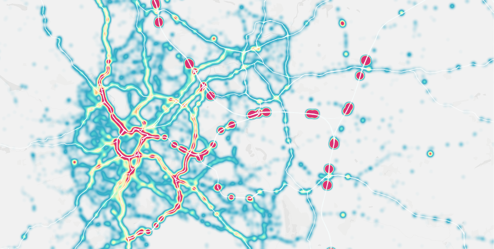
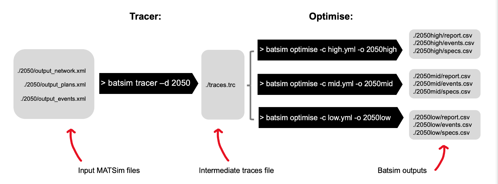

# batsim 🔌

Simulate expected **electric vehicle charging** for an entire population. Model the temporal, spatial and demographic distribution of future energy demand.

Batsim allows you to experiment with:

- future electric vehicle ownership
- future battery and charger technology
- future availability of charging at home at other facilities

 
 *Sheffield en-route demand for charging.*

Batsim is heavilly inspired by concepts taken from **agent-based** and **activity-based** modelling. In particular batsim provides:

- realistic representation of agent-level charging
- temporal and spatial precision

## Develoeprs

This was developed by [Fred Shone](https://github.com/fredshone), [Panos Tsolderidis](https://github.com/panostsolerid), [Michael Fitzmaurice](https://github.com/mfitz) and [Kasia Kozlowska](https://github.com/KasiaKoz) in the Arup City Modelling Lab.

## Key Features

Batsim uses a battery state simulation to allow agents to optimise their charging behaviour. Key features:

- precise measurement of time and location
- full agent hetrogeneity
- realistic activity based representation of demand and charging

## Contents

- [Getting Started](#getting-started)
  - [Inputs](#inputs)
  - [Outputs](#outputs)
  - [Install](#install)
  - [Batsim Help](#batsim-help)
  - [Batsim Run](#batsim-run)
  - [Config Files](#config-files)
- [How does it work?](#how-does-it-work)
  - [Units](#units)
  - [Simulation](#simulation)
  - [Energy Leaks](#energy-leaks)
  - [Wrapping](#wrapping)
  - [En-route Charging Events](#en-route-charging-events)
  - [Normalising](#normalising)
  - [Optmisation](#optmisation)
  - [How do we define best?](#how-do-we-define-best)
  - [Key Limitations](#key-limitations)
- [Dev Plans](#dev-plans)
- [Logging](#logging)
- [Contributing](#contributing)

## Getting Started

### Inputs

Batsim is designed to work as an extension to a [MATSim](https://github.com/matsim-org) simulation. It requires a MATSim synthetic population, network and simulated events file.

### Outputs

Batsim outputs charge events for each agent, detailing charge amount, location and time. Batsim considers two types of charge events:

- `ActivityChargeEvent`: takes place at an activity location (such as home or work)
- `EnRouteChargeEvent`: takes place on a link of the network during an agent's trip

Batsim also outputs a report for each agent, detailing the number of charge events and their magnitude from the different charge types.

### Install

You can either:
- Donload a pre-built executable from [releases](https://github.com/arup-group/BatterySimulator/releases), or
- Build your own executable using git and the rust toolchain

#### Download

1) Download binary from [Releases](https://github.com/arup-group/BatterySimulator/releases)
2) Find and unzip downloaded file if required: tar -xvf EXECUTABLE.tar.xz
3) Within the unzipped folder you should find the executable `batsim`
4) To make the `batsim` command more accessible, add the directory where it is located to PATH (or move it somewhere already on your PATH)
5) For example by adding `export PATH="${HOME}/PATH_TO_EXECUTABLE_DIRECTORY:${PATH}"` to your shell config file
6) You can find help with OS specific cases [here](https://zwbetz.com/how-to-add-a-binary-to-your-path-on-macos-linux-windows/)

#### Build

1) You will need rust and it's toolchain, [start here](https://www.rust-lang.org/tools/install)
2) clone this repo
3) Then run `cargo build --release` from the project root (be patient the first time - you will need to pull and compile all dependencies)
4) This will leave an executable in `target`: `./target/release/batsim`

In the following examples, we assume the batsim executable is added to PATH (or there is a symlink or alias) such that `batsim` works as an executable

### Batsim Help

Batsim is build as a command based CLI. You can explore the various commands, sub-commands and options using `--help`:

```{.sh}
❯ batsim --help
```

```{.sh}
Usage: batsim <COMMAND>

Commands:
  run         Run the full batsim pipeline
  tracer      Pre-process MATSim outputs into traces
  optimise    Calculate optimal charge events from given traces
  dryrun      Dry run agent configurations
  attributes  Peek attributes in a plans file
  help        Print this message or the help of the given subcommand(s)

Options:
  -h, --help     Print help information
  -V, --version  Print version information
```

### Batsim Run

This is the expected entry point for first time users.

```{.sh}
❯ batsim run --help
```

```{.sh}
Run the full batsim pipeline

Usage: batsim run [OPTIONS]

Options:
  -c, --config <CONFIG>          Config path
  -d, --dir <DIR>                MATSim output directory [default: tests/data]
  -n, --network <NETWORK>        Name of network file [default: output_network.xml]
  -p, --population <POPULATION>  Name of plans file [default: output_plans.xml]
  -e, --events <EVENTS>          Name of events file [default: output_events.xml]
  -t, --trace-path <TRACE_PATH>  Path to traces file [default: traces.trc]
  -o, --outpath <OUTPATH>        Output directory path [default: outputs]
  -j, --json                     Write traces to human readable json format
  -h, --help                     Print help information
  -V, --version                  Print version information
```

`batsim run` starts a "full" run, but it is often more sensible to use `batsim` in two stages:

1. `batsim tracer` - combine input MATSim files into the traces format
2. `batsim optimise` - simulate optimal charging for given traces and config

Because `batsim tracer` is relatively slow (approx. 2 minutes for 50,000 agents) and does not change unless you change the input MATSim data, suggested practice is to run `batsim tracer` once for a given project and then consider any number of battery simulations using `batsim optimise`.

 
 *Batsim `tracer` -> `optimise` run pattern.*

You can discover these available options for these commands using `batsim tracer --help` and `batsim optimise --help`. Note that if you have used the `--json` flag to build your traces in a human readbale format, you will the also need to let batsim optimise know to use this format using the same flag.

`batsim optimise` uses a config file to specify agents' battery capabilities, behaviours and restrictions in simulation. This can be use to quickly consider future scenarios, for example:

- What and when is the expected peak energy demand at charger location X?
- What happens to expected en-route demand for energy, if battery technology improves?
- What are the equity impacts of assigning better access to charging for higher income agents?
- Does reducing access to at-home charging reduce peak demand?

### Config Files

The `batsim run` and `optimise` commands use a config file to control how the simulation runs and specify available battery technology and access to charging.

Batsim config files allow concise specification of highly heterogenous behaviours based on agent attributes (taken form the input MATSim population). The default configuration is as follows:

```{.yaml}
name: None
scale: 1.0
precision: 1.0
patience: 100
seed: None

battery_group:
- name: default
  capacity: 100  // maximum battery charge, kWh
  initial: 100  // initial state of charge, kWh
  consumption_rate: 0.15 // rate at which agent will run down charge, kWh per km

trigger_group:
- name: default
  trigger: 0.2  // proportion of battery capacity at which agent will seek to charge

enroute_group:
- name: default
  charge_rate: 10  // en-route station charging rate, kW

```

This gives all agents access to a default battery specification, trigger (risk) behaviour and en-route charge rate. This does not give access to charging at any activities (including at home). To do this (and far more) please refer to the [config readme](https://github.com/arup-group/batsim/blob/main/docs/CONFIG_README.md) or to an example.

> Unless explicitly said otherwise, we use Kilowatts (kW) for energy, kilometres (km) for distance and hours (h) for time.

## How does it work?

### Units

The simulation within batsim uses seconds, metres and Watts. But for convenience inoputs and outputs use the following units unless stated otherwise:
- kW
- hour
- km

### Simulation

Batsim uses an agent level battery state simulation to monitor battery state for a given **trace** and **charging plan**.

> **trace**: an agent's sequence of activities and trips that make up their activity sequence. Including detailed information about the link traversals that make up their trips.

> **charging plan** specifies at which activities, in their trace, an agent will seek to charge their vehicle. For example, an agent may plan to charge at home overnight or at work during the day.

### Energy Leaks

A key concept of this simulation is that is repeats the trace, typically a 24 hour activity sequence, until either it runs out of `patience` (default is 100 repetitions), or a stable loop is found, where the battery state at the end of the iteration matches the state at the start of the same or a previous iteration.

Such 'closed' loops are convenient as they result in no net gain or loss of energy (a "leak"). They can also be thought of as a stable pattern of longer term behaviour by the agent. However, where simulations are not 'closed', a **leak** is reported.

> **leak**: The net gain in energy by an agent or agents. This is reported for each agent and the entire run, ideally it is relatively a small number.

When batsim runs out of patience with an agent's charging plan, it will choose the best loop possible by slicing the records at a start and end point that minimise the absolute value of the energy leak.

### Wrapping

Batsim **tracer** wraps the final activity of a plan into the first activity of a plan if they are the same type of activity. For example, an agent with a plan that is at home at the start **and** end of the day, will have these home events "wrapped" into a single activity. In this case, wrapping better represents the opportunity for a long overnight charge.

### En-route Charging Events

So far we have only really considered charging that takes place at activity locations, for example at home, as part of each agent's activity plan. However, we also consider charging that is expected to take place on the network, called **en-route** charging.

In simulation, agents trigger an en-route charge event at the time and location that their battery state runs down to a defined `trigger` level. Agents will then charge their vehicle as required to reach their next charge activity (restricted by their battery capacity). Agents with no activity charge in their charge plan will charge to full.

Crucially there is no re-routing or re-scheduling caused by en-route charge events. It is therefore useful to think of en-route charge events as a "desire to charge at the defined location and time" rather than actual charge events, which is more the case for activity charging.

### Normalising

Agent simulation loops can vary in length, depending on how quickly, or if, they stabilise/close. Batsim therefore reports the sum and count of charge events for an average input plan duration (typically a day). Care should therefore be taken when considering discrete charge events, as their charge magnitude is averaged to account for this.

We expect to add a "random sample" normaliser in future.

### Optimisation

So far, we have discussed simulation given a single **charging plan** for each agent. Batsim `optimise` searches *all* viable **charging plans** for each agent and reports the best.

### How do we define best?

The best **charging plan** for each agent is defined as that which **minimises** the following (in order):

1. average number of **en-route** charge events per day
2. average duration of **en-route** charge events per day (this is currently approx. equivalent to cost)
3. average number of **activity** charge events per day

This can be interpreted as follows - Agents will first seek to minimise the number of times they have to stop en-route and charge their vehicle. Agents will second seek to minimise the total duration of such en-route charge events. Finally, agents will seek to minimise the number of activity charges.

This leads to the following key outcomes:

- agents do not like to stop en-route during a trip and charge their vehicle
- they therefore prefer charging during activities (such as while at home or work as available)
- given the choice between two plans, both requiring en-route charging, agents will seek to minimise the size of the charge required en-route
- agents like to minimise the number of times they need to charge at activities, for example they would rather charge for a long time overnight than charge at multiple other activities during the day

The simulation based `optimise` methodology is flexible. We expect to add more detail in future, for example to allow consideration of time-of day variable pricing.

### Key Limitations

- agents do not reroute trips to arrive at en-route charging facilities
- agents do not re-schedule plans due to the duration of en-route charge events
- agents do not interact, for example to queue at charger facilities

- agents do not have heterogeneous charging preferences, therefore the heterogeneity that is captured currently is limited to the activity plans of the agents. For example, agents of different sociodemographic groups might be more risk takers or risk averse and choose respectively their preferred charging plan. Or en-route charging might be more likely to happen when travelling for specific purposes, e.g. leisure trips, than others, e.g. commuting or business trips, where arrival time is more important.

We are looking forward to tackle these in future.

## Dev Plans

- examples
- cross platform compile and release for linux(aws)/windows
- improve input energy units, provide some sense-checking at configuration
- tracer is currently using serde_json for serialisation/deserialisation, this is both slow and wasteful, we would like to replace
- trace deserialisation should implement a "streaming" parser to allow faster simulation runs
- as we add more complexity, we should use some parallelisation
- we will keep an eye out on alternative inputs, such as GPS traces
- there are still some unnecessary `String`s likely slowing things down (see all the to_string())
- we will consider adding more useful output formats (geojson?)
- we will consider adding typically post processing examples
- consider different initial battery states, maybe a random initialisation will be impactful - requires experimentation
- generally we would like to abstract the key mechanics of batsim, such that it is easier to modify and add complexity
- we expect in future to want to add more detail to the simulation of batteries, for example to consider vehicle speed and link gradient
- we expect to add more complexity to the scoring and simulations, for example considering monetary costs and queuing
- we expect to want to simulate interactions, such as charger queues
- we expect to want to simulate rerouting
- we expect to want to simulate rescheduling
- considering the above we may consider moving to a utility based plan fitness

## Logging

Batsim uses [env_logger](https://lib.rs/crates/env_logger). You can change logging level via your environment as follows:

`export RUST_LOG=info` (OSX) or `set RUST_LOG=info` (Windows)

The following [log](https://crates.io/crates/log) levels are supported:

- error
- warn
- info
- debug
- trace
- off

## Contributing

Refer to [CONTRIBUTING.md](https://github.com/arup-group/batsim/blob/main/CONTRIBUTING.md) for full guidance.

### Linting

We require commits to be formatted (`cargo fmt --all`) using latest stable release. We also request you use clippy to check your style (`cargo clippy`). You can run linting using `sh scripts/lint.sh`.

### Tests

Tests can be run from root using `cargo test`. Please test your work - there is a guide to tests in rust [here](https://doc.rust-lang.org/book/ch11-01-writing-tests.html).

### Code Coverage

Install the code coverage tool: `cargo install cargo-tarpaulin`

To generate a html which you can then inspect: `cargo tarpaulin -o html --output-dir ./report`

### Releases

Releases are triggered by pushing tags formatted `vX.X.X`. Releases should not include changes other than to CHANGELOG.md. For more details on how releses work, refer to [cargo-dist](https://github.com/axodotdev/cargo-dist).